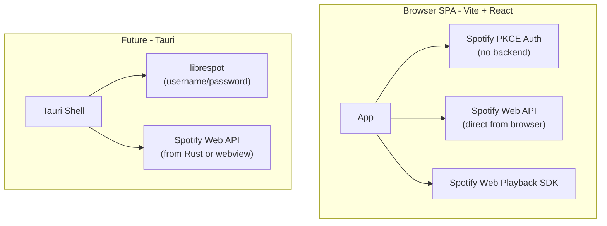

# Migration Plan: Next.js → Vite SPA

## Context: Why Next.js adds zero value here

The codebase has **zero SSR usage** — no `getServerSideProps`, no `getStaticProps`. Everything is `useEffect` client-side fetching. The app is already a SPA riding on a Next.js chassis. The only things Next.js contributes are:

- Two tiny API routes (`/api/oauth-callback`, `/api/oauth-refresh`) that hold `SPOTIFY_CLIENT_SECRET`
- Hosting

## Do you need a backend?

**Short answer: only temporarily, and barely.**

The `client_secret` is the only thing that _requires_ a server today. The Authorization Code flow needs it to exchange the `code` for tokens. However, Spotify's **PKCE flow** (Authorization Code + PKCE) is designed for public clients (SPAs, native apps) and requires **no `client_secret**` at all. Switching to PKCE lets you eliminate the backend entirely in the browser phase.

- PKCE is now Spotify's recommended approach for SPAs (they deprecated the implicit grant flow)
- Token refresh also works without a server — PKCE refresh tokens are exchanged client-side
- Your existing `oauth-callback` and `oauth-refresh` API routes become dead code

**Long-run (Tauri + librespot):** librespot handles auth with username/password internally, so OAuth is irrelevant. The Web Playback SDK also goes away in favor of librespot's native playback.

**Recommendation: skip the interim server entirely.** Switch to PKCE now.

## What frontend build system?

**Vite** is the right choice. It's the industry standard for pure SPA/Tauri apps:

- Tauri's official scaffolding uses Vite natively
- Extremely fast HMR, tiny config
- TanStack Start and others are built on top of it, but they add SSR capability you don't need
- No framework lock-in — just Vite + React

## Architecture after migration

## Migration steps

### 1. Scaffold Vite app

Replace Next.js scaffold with `npm create vite@latest -- --template react`. Keep all components unchanged.

### 2. Switch auth to PKCE

- Remove `[src/pages/api/oauth-callback.js](src/pages/api/oauth-callback.js)` and `[src/pages/api/oauth-refresh.js](src/pages/api/oauth-refresh.js)`
- Rewrite `getTokens()` / auth flow in `[src/functions.js](src/functions.js)` using PKCE:
  - Generate `code_verifier` + `code_challenge` in the browser
  - Redirect to Spotify authorize with `code_challenge`
  - Handle the callback in the SPA (using the catch-all route), exchange code client-side
  - Store tokens in `localStorage` (or keep cookie, your call)
  - Refresh using `grant_type=refresh_token` directly from the browser (no secret needed)

### 3. Replace routing

- Remove the hybrid Next.js pages + wouter-memoryLocation pattern
- Use **wouter** (already a dependency) purely as the SPA router with hash or history mode
- The `[[...params]].js` catch-all collapses into a single `App.jsx` root

### 4. Wire up discography using SSE

`Artist.js` currently has two competing approaches that need to be reconciled:

- An old bare `EventSource('http://localhost:3100/discography')` listener (lines 57–69) — hardcoded to a local dev server, not wired to the artist `id`
- A newer `fetchDiscography()` (lines 8–44) that hits `/api/artist/:id/discography` via `ReadableStream` — but the API route is a stub (`// use from repos/schwab-oauth-proxy`)
- `dan.js` shows the clean SSE version of the same concept — progressively appending `albums`/`singles` to state as SSE `message` events arrive

The right approach (which `dan.js` demonstrates) is to implement the `/api/artist/:id/discography` route as a proper SSE endpoint:

1. It immediately sends a first event with whatever fast data it has (e.g. albums from `/artists/:id/albums`)
2. It then streams follow-up events as slower data arrives (e.g. fetching each album's tracks in parallel, emitting each batch)
3. The client (`Artist.js`) uses `EventSource` pointed at `/api/artist/${id}/discography` and appends to state on each `message` event — replacing the `fetchDiscography` ReadableStream experiment

Since we're going serverless/static, this SSE endpoint needs somewhere to live. Options:

- **Cloudflare Worker / Edge Function** — fits perfectly, cheap, zero infrastructure
- **Vercel Edge Function** — if deploying to Vercel
- A tiny standalone server (simpler short-term)

This is the one piece of real server logic worth keeping, since it fans out multiple Spotify API calls and streams results back progressively. It's a natural fit for an edge function.

### 5. Deploy as static files

Vite builds to `dist/` as pure static HTML/JS/CSS — deployable to Cloudflare Pages, Vercel (static), Netlify, or an S3 bucket with zero server needed.

## Key files affected

- `package.json` — swap `next` for `vite`, `@vitejs/plugin-react`
- `src/pages/` — reorganize as `src/` with `main.jsx` entry point
- `src/functions.js` — rewrite auth to PKCE
- `src/pages/api/` — deleted entirely
- `src/styles/globals.css` — move to `src/index.css`
- `tailwind.config.js` / `postcss.config.js` — keep as-is, Vite supports both

## What stays the same

All React components (`Artist.js`, `Album.js`, `Playlist.js`, `ArtistLinks.js`, `PopularityChart.js`) are plain React — zero changes needed.
